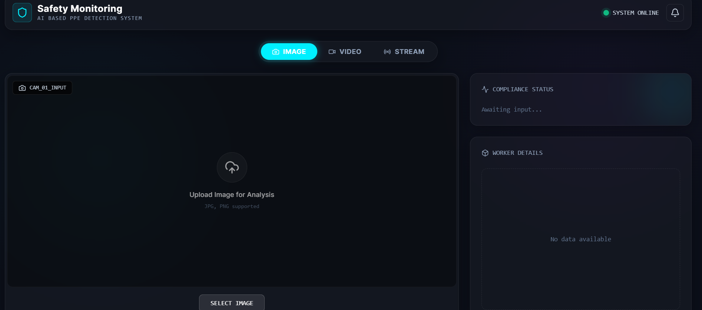
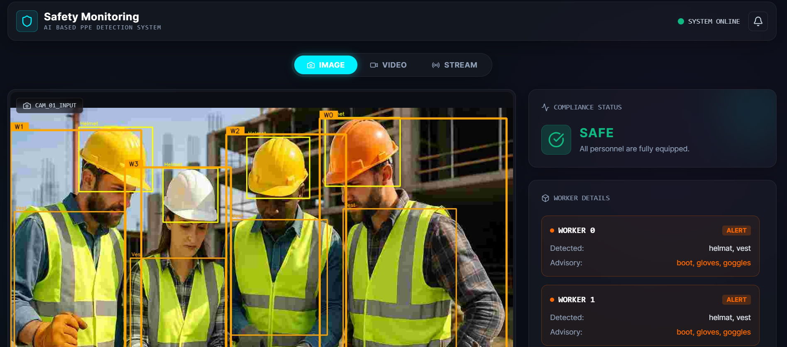
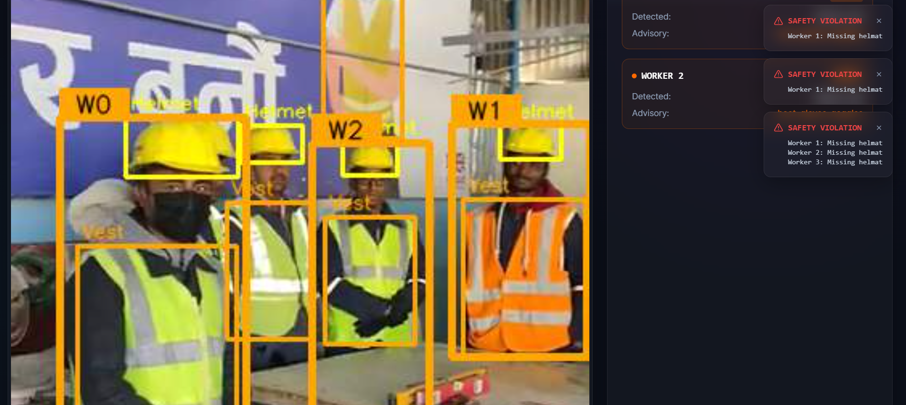
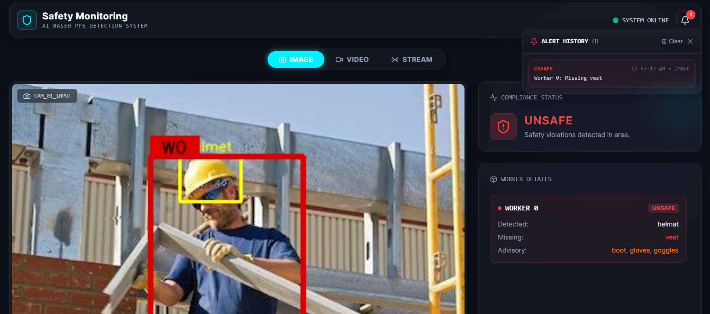
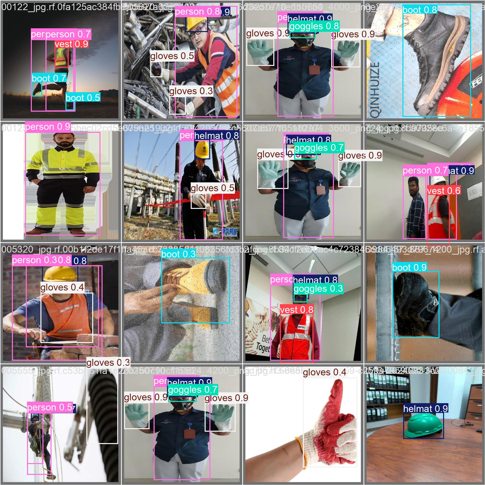
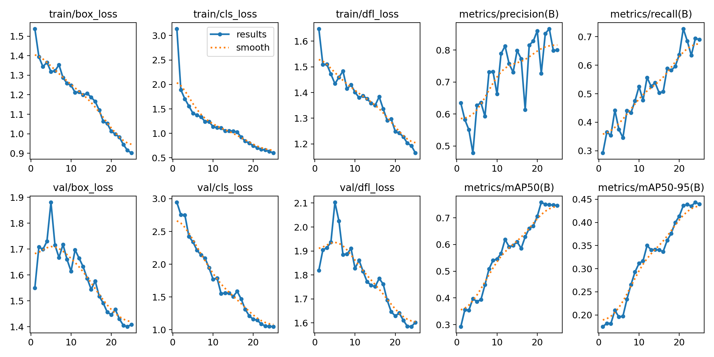
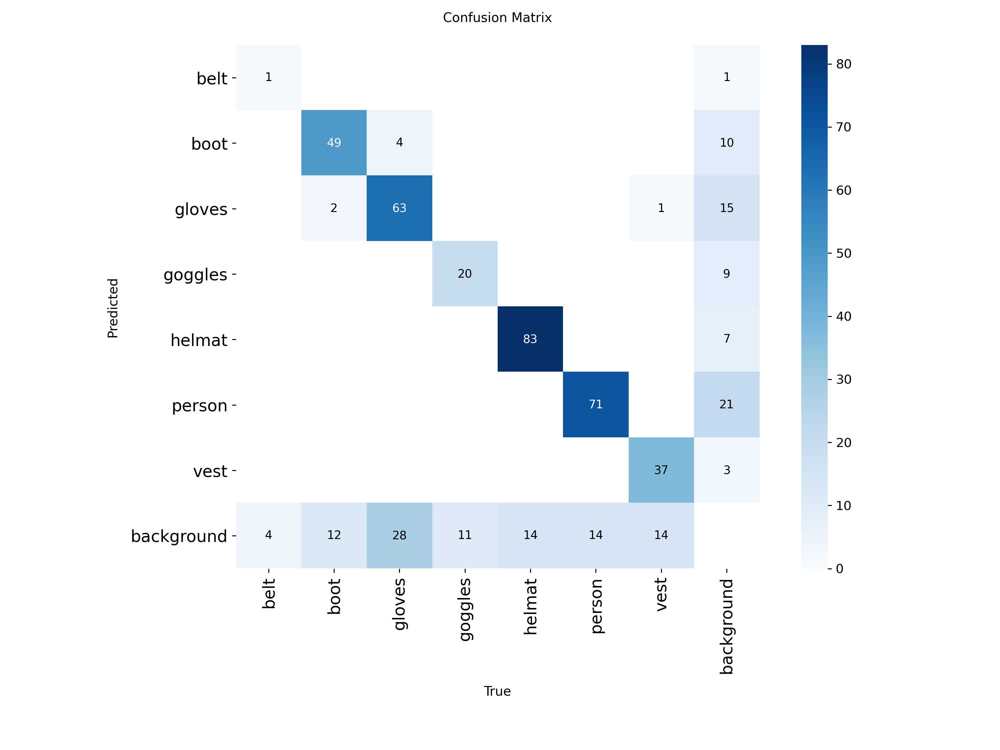

# Construction Site PPE Compliance Monitoring System

A real-time computer vision system that detects construction workers and verifies whether each worker is wearing the required Personal Protective Equipment (PPE). The system provides per-worker compliance status and a scene-level verdict of **SAFE**, **ALERT**, or **UNSAFE** — accessible via a CLI tool, a REST API, and a React web dashboard.



<table>
  <tr>
    <td align="center"><br/><b>Image Analysis</b></td>
    <td align="center"><br/><b>Video Analysis</b></td>
    <td align="center"><br/><b>Alert Notification</b></td>
  </tr>
</table>

---

## Features

- **YOLOv8s Object Detection** — Detects workers and 5 PPE classes (helmet, vest, boots, gloves, goggles)
- **Rule-Based Compliance Engine** — Decoupled from detection; checks critical vs. advisory PPE per worker
- **Three Input Modes** — Image upload, video file processing, and live webcam/RTSP streaming
- **FastAPI Backend** — REST endpoints for image/video analysis + WebSocket for real-time streaming
- **React Dashboard** — Dark-themed, glassmorphism UI with real-time analytics, alert notifications, and video playback controls
- **CLI Inference** — Run detection directly from the command line on images, videos, or webcam

---

## Demo Outputs

### Detection Samples (Validation Set)



### Training Curves



### Confusion Matrix



---

## Project Structure

```
Construction-Safety-Monitor/
├── src/
│   ├── api.py                # FastAPI backend (REST + WebSocket)
│   ├── inference.py          # CLI inference pipeline (image/video/webcam)
│   ├── compliance.py         # PPE compliance rule engine
│   ├── evaluate.py           # Model evaluation script
│   ├── train.py              # Training script (Colab)
│   └── data_preparation.py   # Dataset validation
├── frontend-ppe/             # React + Vite frontend
│   ├── src/
│   │   ├── App.jsx           # Main dashboard component
│   │   ├── index.css         # Global styles
│   │   └── App.css           # Component styles
│   └── package.json
├── models/
│   └── best.pt               # Trained YOLOv8s weights
├── notebooks/
│   └── training.ipynb        # Google Colab training notebook
├── data/
│   └── raw/                  # Roboflow dataset (YOLOv8 format)
├── outputs/
│   ├── evaluation_report.json
│   └── runs/                 # Training artifacts (curves, confusion matrix)
├── docs/
│   ├── safety_rules.md
│   └── dataset.md
└── requirements.txt
```

---

## Tech Stack

| Component | Technology |
|-----------|-----------|
| Detection Model | YOLOv8s (Ultralytics) |
| Backend | FastAPI, OpenCV, Python |
| Frontend | React 19, Vite, Tailwind CSS, Lucide Icons |
| Training | Google Colab (T4 GPU) |
| Dataset | Roboflow (500 images, 7 classes, YOLOv8 format) |

---

## Getting Started

### Prerequisites

- Python 3.9+
- Node.js 18+
- Trained model weights (`models/best.pt`)

### 1. Clone the Repository

```bash
git clone https://github.com/NaveenSa98/Construction-Safety-Monitor.git
cd Construction-Safety-Monitor
```

### 2. Install Backend Dependencies

```bash
pip install -r requirements.txt
```

### 3. Start the Backend API

```bash
uvicorn src.api:app --reload --host 0.0.0.0 --port 8000
```

The API will be available at `http://localhost:8000`.

### 4. Start the Frontend

```bash
cd frontend-ppe
npm install
npm run dev
```

The dashboard will open at `http://localhost:5173`.

---

## Usage

### Web Dashboard

1. Open the dashboard and select a mode: **IMAGE**, **VIDEO**, or **STREAM**
2. Upload an image or video, or connect to a live webcam/RTSP feed
3. View real-time compliance results — per-worker PPE status and scene verdict
4. Receive toast alerts with audio beep when UNSAFE violations are detected

### CLI Inference

```bash
# Single image
python src/inference.py --weights models/best.pt --source path/to/image.jpg

# Save annotated output
python src/inference.py --weights models/best.pt --source path/to/image.jpg --output outputs/result.jpg

# Video file
python src/inference.py --weights models/best.pt --source path/to/video.mp4 --output outputs/result.mp4

# Live webcam
python src/inference.py --weights models/best.pt --source 0
```

---

## API Endpoints

| Method | Endpoint | Description |
|--------|----------|-------------|
| `POST` | `/analyze` | Upload an image → returns annotated image + compliance report |
| `POST` | `/analyze_video` | Upload a video → returns frame-by-frame annotated results |
| `WS` | `/ws/stream` | WebSocket for real-time webcam/RTSP streaming |

---

## Compliance Logic

### Scene Verdict

| Verdict | Condition |
|---------|-----------|
| **SAFE** | Every worker has helmet + vest (critical PPE) |
| **UNSAFE** | Any worker is missing helmet or vest |

### PPE Classification

| Tier | Items | Impact |
|------|-------|--------|
| **Critical** | Helmet, Vest | Missing → worker non-compliant → UNSAFE |
| **Advisory** | Boots, Gloves, Goggles | Missing → per-worker warning only |

### Association Algorithm

- Each PPE item is assigned to the worker with the highest IoU score
- Worker bounding boxes are expanded by 50% to catch edge PPE (e.g., helmet above bent worker)
- Vertical zone heuristics prevent impossible associations (e.g., helmet at feet)
- Person NMS deduplicates overlapping worker detections

---

## Model Performance

| Metric | Score |
|--------|-------|
| **mAP@50** | 0.750 |
| **mAP@50-95** | 0.457 |
| **Precision** | 0.752 |
| **Recall** | 0.658 |

### Per-Class Results

| Class | Precision | Recall | mAP@50 |
|-------|-----------|--------|--------|
| Person | 0.919 | 0.877 | 0.944 |
| Helmet | 0.886 | 0.978 | 0.964 |
| Boot | 0.816 | 0.810 | 0.913 |
| Goggles | 0.977 | 0.813 | 0.842 |
| Gloves | 0.847 | 0.479 | 0.724 |
| Vest | 0.815 | 0.652 | 0.804 |

---

## Training

Training was done on Google Colab with a T4 GPU using the notebook at `notebooks/training.ipynb`.

- **Model:** YOLOv8s (small variant — prevents overfitting on 500-image dataset)
- **Epochs:** 25
- **Batch Size:** 16
- **Dataset:** [Construction PPE (Roboflow)](https://universe.roboflow.com/zukoos-workspace/construction-ppe-fwz4e/dataset/1) — 500 images, 7 classes

To retrain:

1. Upload project to Google Drive
2. Open `notebooks/training.ipynb` in Colab with T4 GPU
3. Run all cells — weights saved to `runs/train/ppe_yolov8s/weights/best.pt`

---

## Known Limitations

| Limitation | Detail |
|------------|--------|
| Small dataset | 500 images — rare classes (gloves, goggles) have lower recall |
| Occlusion | Heavily occluded PPE (e.g., gloves behind body) may not be detected |
| No tracking | Each frame is evaluated independently — no temporal smoothing |
| Single angle | Performance may vary with different camera angles or lighting |

